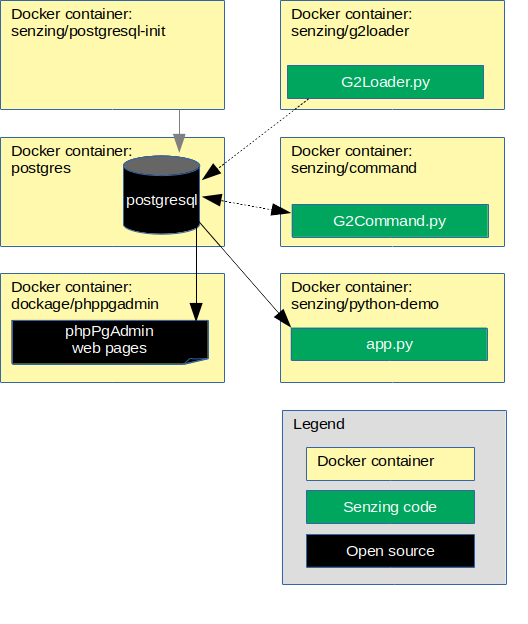

# docker-compose-postgresql-demo

## Overview

The following diagram shows the relationship of the docker containers in this docker composition.



This docker formation brings up the following docker containers:

1. *[mysql](https://hub.docker.com/_/mysql)*
1. *[phpmyadmin/phpmyadmin](https://hub.docker.com/r/phpmyadmin/phpmyadmin)*
1. *[senzing/mysql-init](https://github.com/Senzing/docker-mysql-init)*
1. *[senzing/python-demo](https://github.com/Senzing/docker-python-demo)*

Also shown in the demonstration are commands to run the following Docker images:

1. *[senzing/g2loader](https://github.com/Senzing/docker-g2loader)* in [Run G2Loader.py](#run-g2loaderpy)
1. *[senzing/g2command](https://github.com/Senzing/docker-g2command)* in [Run G2Command.py](#run-g2commandpy)

### Contents

1. [Preparation](#preparation)
    1. [Set environment variables](#set-environment-variables)
    1. [Clone repository](#clone-repository)
    1. [Create SENZING_DIR](#create-senzing_dir)
    1. [Prerequisite Software](#prerequisite-software)
1. [Using docker-compose](#using-docker-compose)
    1. [Build docker images](#build-docker-images)
    1. [Configuration](#configuration)
    1. [Launch docker formation](#launch-docker-formation)
    1. [Test docker formation](#test-docker-formation)
    1. [Run G2Loader.py](#run-g2loaderpy)
    1. [Run G2Command.py](#run-g2commandpy)
1. [Cleanup](#cleanup)

### Shortcut

The following is the full description of the demonstration.
For a "short cut" version of the command, see
[demo-shortcuts](doc/demo-shortcuts.md).

## Preparation

### Set environment variables

1. These variables may be modified, but do not need to be modified.
   The variables are used throughout the installation procedure.

    ```console
    export GIT_ACCOUNT=senzing
    export GIT_REPOSITORY=docker-compose-mysql-demo
    ```

1. Synthesize environment variables.

    ```console
    export GIT_ACCOUNT_DIR=~/${GIT_ACCOUNT}.git
    export GIT_REPOSITORY_DIR="${GIT_ACCOUNT_DIR}/${GIT_REPOSITORY}"
    export GIT_REPOSITORY_URL="https://github.com/${GIT_ACCOUNT}/${GIT_REPOSITORY}.git"
    ```

### Clone repository

1. Get repository.

    ```console
    mkdir --parents ${GIT_ACCOUNT_DIR}
    cd  ${GIT_ACCOUNT_DIR}
    git clone ${GIT_REPOSITORY_URL}
    ```

### Create SENZING_DIR

If you do not already have an `/opt/senzing` directory on your local system, visit
[HOWTO - Create SENZING_DIR](https://github.com/Senzing/knowledge-base/blob/master/HOWTO/create-senzing-dir.md).

### Prerequisite software

The following software programs need to be installed.

#### docker

1. [Install docker](https://github.com/Senzing/knowledge-base/blob/master/HOWTO/install-docker.md)
1. Test

    ```console
    sudo docker --version
    sudo docker run hello-world
    ```

#### docker-compose

1. [Install docker-compose](https://github.com/Senzing/knowledge-base/blob/master/HOWTO/install-docker-compose.md)
1. Test

    ```console
    sudo docker-compose --version
    ```

## Using docker-compose

### Build docker images

1. Build docker images.

    ```console
    sudo docker build --tag senzing/python-base https://github.com/senzing/docker-python-base.git
    sudo docker build --tag senzing/mysql       https://github.com/senzing/docker-mysql.git
    sudo docker build --tag senzing/mysql-init  https://github.com/senzing/docker-mysql-init.git
    sudo docker build --tag senzing/python-demo https://github.com/senzing/docker-python-demo.git
    sudo docker build --tag senzing/g2loader    https://github.com/senzing/docker-g2loader.git
    sudo docker build --tag senzing/g2command   https://github.com/senzing/docker-g2command.git
    ```

### Configuration

- **SENZING_DIR** -
  Path on the local system where
  [Senzing_API.tgz](https://s3.amazonaws.com/public-read-access/SenzingComDownloads/Senzing_API.tgz)
  has been extracted.
  See [Create SENZING_DIR](#create-senzing_dir).
  No default.
  Usually set to "/opt/senzing".
- **MYSQL_ROOT_PASSWORD** -
  The password for the the database "root" user name.
  Default: "root"
- **MYSQL_STORAGE** -
  Path on local system where the database files are stored.
  Default: "/storage/docker/senzing/docker-compose-mysql-demo"
- **MYSQL_xxxx** - See [github.com/Senzing/docker-mysql](https://github.com/Senzing/docker-mysql)
  for more details on how to find values for other **MYSQL_** environment variables.

### Launch docker formation

#### Variation 1

1. Launch docker-compose formation.  Example:

    ```console
    cd ${GIT_REPOSITORY_DIR}

    export SENZING_DIR=/opt/senzing
    export MYSQL_HOST=senzing-mysql
    export MYSQL_DATABASE=G2
    export MYSQL_ROOT_PASSWORD=root
    export MYSQL_USERNAME=g2
    export MYSQL_PASSWORD=g2
    export MYSQL_STORAGE=/storage/docker/senzing/docker-compose-mysql-demo

    sudo docker-compose up
    ```

#### Variation 2

1. Launch docker-compose formation with "diskless mysql".
   In this docker formation, the mysql docker container does not externalize `/var/lib/mysql`.
   This is done by using docker's `--tmpfs` parameter rather than its `--volume` parameter.
   Example:

    ```console
    cd ${GIT_REPOSITORY_DIR}

    export SENZING_DIR=/opt/senzing
    export MYSQL_HOST=senzing-mysql
    export MYSQL_DATABASE=G2
    export MYSQL_ROOT_PASSWORD=root
    export MYSQL_USERNAME=g2
    export MYSQL_PASSWORD=g2

    sudo docker-compose -f docker-compose-diskless-mysql.yaml up
    ```

### Test docker formation

1. In the docker-compose log, wait for the following log record:

    ```console
    senzing-mysql-init exited with code 0
    ```

    There will be errors, due to docker container dependencies,
    shown in the docker-compose log until that log record is published.

1. Once docker formation is up, phpMyAdmin will be available at
   [localhost:8080](http://localhost:8080). Login with values specified for `MYSQL_USERNAME` and `MYSQL_PASSWORD`.
1. In Variation #1, the database storage will be on the local system at ${MYSQL_STORAGE}.
   The default database storage path is `/storage/docker/senzing/docker-compose-mysql-demo`.
1. After the schema is loaded, the demonstration python/Flask app will be available at
   [localhost:5000](http://localhost:5000).

### Run G2Loader.py

In a separate terminal window:

1. Determine docker network. Example:

    ```console
    sudo docker network ls

    # Choose value from NAME column of docker network ls
    export SENZING_NETWORK=nameofthe_network
    ```

1. Run `docker` command. Example:

    ```console
    export DATABASE_PROTOCOL=mysql
    export DATABASE_USERNAME=g2
    export DATABASE_PASSWORD=g2
    export DATABASE_HOST=senzing-mysql
    export DATABASE_PORT=3306
    export DATABASE_DATABASE=G2

    export SENZING_DATABASE_URL="${DATABASE_PROTOCOL}://${DATABASE_USERNAME}:${DATABASE_PASSWORD}@${DATABASE_HOST}:${DATABASE_PORT}/${DATABASE_DATABASE}"
    export SENZING_DIR=/opt/senzing

    sudo docker run -it  \
      --volume ${SENZING_DIR}:/opt/senzing \
      --net ${SENZING_NETWORK} \
      --env SENZING_DATABASE_URL="${SENZING_DATABASE_URL}" \
      senzing/g2loader \
        --purgeFirst \
        --projectFile /opt/senzing/g2/python/demo/sample/project.csv
    ```

### Run G2Command.py

In a separate terminal window:

1. Determine docker network. Example:

    ```console
    sudo docker network ls

    # Choose value from NAME column of docker network ls
    export SENZING_NETWORK=nameofthe_network
    ```

1. Run `docker` command. Example:

    ```console
    export DATABASE_PROTOCOL=mysql
    export DATABASE_USERNAME=root
    export DATABASE_PASSWORD=root
    export DATABASE_HOST=senzing-mysql
    export DATABASE_PORT=3306
    export DATABASE_DATABASE=G2

    export SENZING_DATABASE_URL="${DATABASE_PROTOCOL}://${DATABASE_USERNAME}:${DATABASE_PASSWORD}@${DATABASE_HOST}:${DATABASE_PORT}/${DATABASE_DATABASE}"
    export SENZING_DIR=/opt/senzing

    sudo docker run -it  \
      --volume ${SENZING_DIR}:/opt/senzing \
      --net ${SENZING_NETWORK} \
      --env SENZING_DATABASE_URL="${SENZING_DATABASE_URL}" \
      senzing/g2command
    ```

## Cleanup

In a separate terminal window:

1. Run `docker-compose` command.

    ```console
    cd ${GIT_REPOSITORY_DIR}
    sudo docker-compose down
    ```

1. Delete database storage.

    ```console
    sudo rm -rf ${MYSQL_STORAGE}
    ```

1. Delete SENZING_DIR.

    ```console
    sudo rm -rf ${SENZING_DIR}
    ```

1. Delete git repository.

    ```console
    sudo rm -rf ${GIT_REPOSITORY_DIR}
    ```
