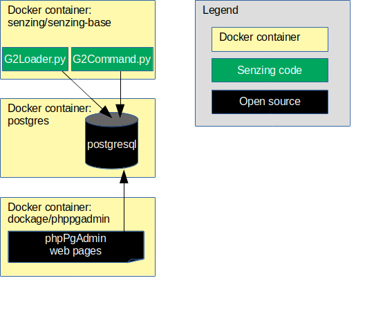

# docker-compose-diskless-postgresql-demo

## Overview

The following diagram shows the relationship of the docker containers in this docker composition.



This docker formation brings up the following docker containers:

1. *[postgres](https://hub.docker.com/_/postgres)*
1. *[dockage/phppgadmin](https://hub.docker.com/r/dockage/phppgadmin)*
1. *[senzing/senzing-base](https://github.com/Senzing/docker-senzing-base)*

### Contents

1. [Expectations](#expectations)
    1. [Space](#space)
    1. [Time](#time)
    1. [Background knowledge](#background-knowledge)
1. [Preparation](#preparation)
    1. [Prerequisite Software](#prerequisite-software)
    1. [Clone repository](#clone-repository)
    1. [Create SENZING_DIR](#create-senzing_dir)
1. [Using docker-compose](#using-docker-compose)
    1. [Configuration](#configuration)
    1. [Launch docker formation](#launch-docker-formation)
    1. [Initialize database](#initialize-database)
    1. [Run G2Loader.py](#run-g2loaderpy)
    1. [Run G2Command.py](#run-g2commandpy)
    1. [Output](#output)
1. [Cleanup](#cleanup)

## Expectations

### Space

This repository and demonstration require 6 GB free disk space.

### Time

Budget 2 hours to get the demonstration up-and-running, depending on CPU and network speeds.

### Background knowledge

This repository assumes a working knowledge of:

1. [Docker](https://github.com/Senzing/knowledge-base/blob/master/WHATIS/docker.md)
1. [Docker-Compose](https://github.com/Senzing/knowledge-base/blob/master/WHATIS/docker-compose.md)
1. [PostgreSQL](https://github.com/Senzing/knowledge-base/blob/master/WHATIS/postgresql.md)

## Preparation

### Prerequisite software

The following software programs need to be installed:

1. [docker](https://github.com/Senzing/knowledge-base/blob/master/HOWTO/install-docker.md)
1. [docker-compose](https://github.com/Senzing/knowledge-base/blob/master/HOWTO/install-docker-compose.md)

### Clone repository

1. Using these environment variable values:

    ```console
    export GIT_ACCOUNT=senzing
    export GIT_REPOSITORY=docker-compose-postgresql-demo
    ```

1. Follow steps in [clone-repository](https://github.com/Senzing/knowledge-base/blob/master/HOWTO/clone-repository.md)
   to install the Git repository.

1. After the Git repository has been cloned, be sure the following environment variables are set:

    ```console
    export GIT_ACCOUNT_DIR=~/${GIT_ACCOUNT}.git
    export GIT_REPOSITORY_DIR="${GIT_ACCOUNT_DIR}/${GIT_REPOSITORY}"
    ```

### Create SENZING_DIR

If you do not already have an `/opt/senzing` directory on your local system, visit
[HOWTO - Create SENZING_DIR](https://github.com/Senzing/knowledge-base/blob/master/HOWTO/create-senzing-dir.md).

## Using docker-compose

### Configuration

* **OUTPUT_DIR** -
  The directory on the local workstation that receives output from the `senzing-playground` docker container.
* **POSTGRES_DB** -
  The database to create upon first invocation. Default: "G2".
* **POSTGRES_PASSWORD** -
  The password for the the database "postgres" user name.
  Default: "postgres"
* **SENZING_DIR** -
  Path on the local system where
  [Senzing_API.tgz](https://s3.amazonaws.com/public-read-access/SenzingComDownloads/Senzing_API.tgz)
  has been extracted.
  See [Create SENZING_DIR](#create-senzing_dir).
  No default.
  Usually set to "/opt/senzing".

### Launch docker formation

1. Launch docker-compose formation.  Example:

    ```console
    cd ${GIT_REPOSITORY_DIR}

    sudo \
      OUTPUT_DIR=/tmp \
      POSTGRES_DB=G2 \
      POSTGRES_PASSWORD=postgres \
      SENZING_DIR=/opt/senzing \
      docker-compose --file docker-compose-diskless-postgresql.yaml up
    ```

### Initialize database

1. Log into the `senzing-postgres` docker container.  Example:

    ```console
    sudo docker exec -it senzing-postgres /bin/bash
    ```

1. In the `senzing-postgres` docker container, import the Senzing SQL file using the
   [psql](https://www.postgresql.org/docs/11/app-psql.html) command line tool and
   [PostgreSQL environment variables](https://www.postgresql.org/docs/current/libpq-envars.html).
   Example:

    ```console
    export PGUSER=postgres
    export PGPASSWORD=postgres

    psql \
      --dbname=G2 \
      --echo-all \
      --file /opt/senzing/g2/data/g2core-schema-postgresql-create.sql
    ```

### Run G2Loader.py

1. Log into the `senzing-playground` docker container.  Example:

    ```console
    sudo docker exec -it senzing-playground /bin/bash
    ```

1. In the `senzing-playground` docker container, run the `G2Loader.py` command. Example:

    ```console
    cd /opt/senzing/g2/python

    python G2Loader.py \
      --purgeFirst \
      --projectFile /opt/senzing/g2/python/demo/sample/project.csv
    ```

### Run G2Command.py

1. In the `senzing-playground` docker container, run the `G2Command.py` command. Example:

    ```console
    cd /opt/senzing/g2/python

    python G2Command.py
    ```

### Output

1. In the `senzing-playground` docker container, create output. Example:

    ```console
    echo "Made inside the senzing-playground docker container." > /output/from-senzing-playground.txt
    ```

1. The file will be on the docker host (i.e. not in the docker container) at ${OUTPUT_DIR}/from-senzing-playground.txt

## Cleanup

In a separate terminal window:

1. Run `docker-compose` command.

    ```console
    cd ${GIT_REPOSITORY_DIR}
    sudo docker-compose --file docker-compose-diskless-postgresql.yaml down
    ```

1. Delete SENZING_DIR.

    ```console
    sudo rm -rf ${SENZING_DIR}
    ```

1. Delete git repository.

    ```console
    sudo rm -rf ${GIT_REPOSITORY_DIR}
    ```
